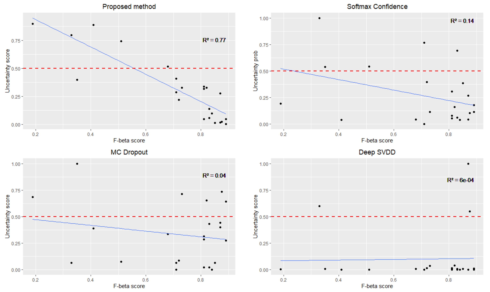

# Detecting-Patient-Uncertainty-in-Seizure-Detection
The technique utilised mathematical logic and deep learning for uncertainty detection on patient level. It does not detect uncertainty on a specific segment/event/time. Users can replace the feature extractor method with their own method. It is compatible with most of the CNN models for seizure detection.

## Scenario
Given a patient's EEG data containing hours of recordings, the algorithm assesses whether the trained model can confidently classify the entire recording at the patient level. By applying a confidence threshold, the algorithm determines the level of uncertainty in the model’s predictions on patient-level, ensuring safe and reliable assessment of EEG recordings. 

## Warnings
Users intending to use the algorithm for patient-level uncertainty estimation are encouraged to ensure that the EEG data used for training and testing includes a large number of patients, seizure types, and varying conditions so that the algorithm is able to demonstrate its clinical applicability.  To ensure the algorithm works effectively, it is recommended to run it in a Jupyter environment using your own CNN model. This will allow you to observe the distribution of the EEG data and make any necessary adjustments for compatibility and better performance.

## Getting Started
Make sure you have your EEG data in numpy format. Depending on the training and evaluation method, you might have to run the model several times for large group of patients. Run the script in the following orders:
1. training_seizure_detection_script.py: Trains the base seizure detection model using a CNN architecture commonly implemented in seizure detection studies, designed to process 1-second segments with 22 EEG channels.
2. training_uncertainty_estimator.py: Trains the base uncertainty estimators. It requires the training EEG data and CNN models 
3. Detecting-Patient-Uncertainty-in-Seizure-Detection: Added mathmatical logic and imported the uncertainty estimators required for uncertatinty prediction. It makes a prediction for patient level uncertainty.

## Results
Our proposed method achieved the highest correlation coefficient when measuring the uncertainty scores for each patient against their F1-score in CHB-MIT dataset.

## TODO
1. Codes for other OOD/uncertainty estimation methods. 
3. Limitations
